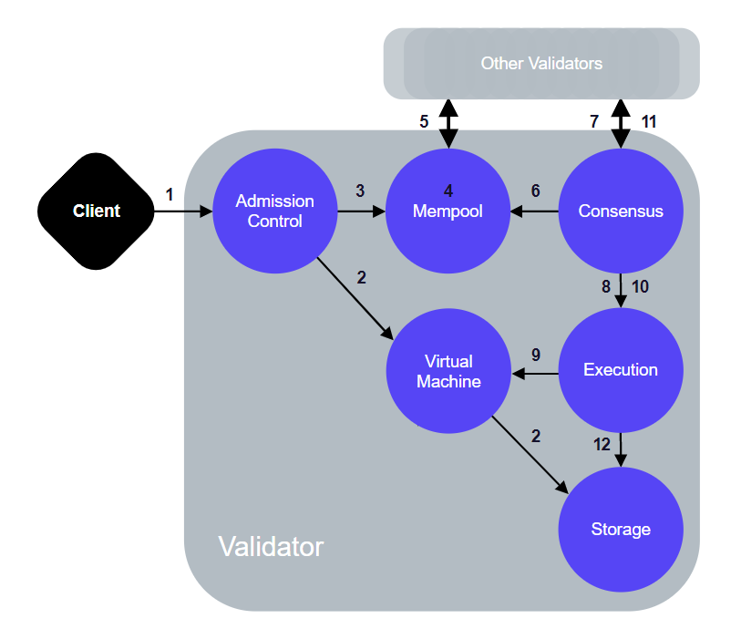
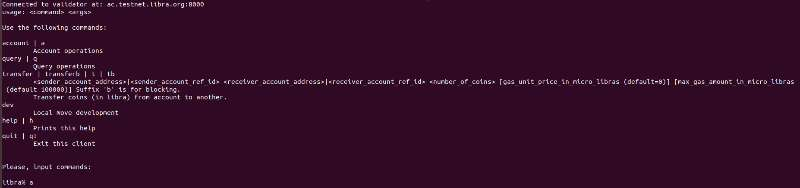

# Libra 原理说明、环境搭建与发送交易

 

## 一、前言

了解 Libra 的最好途径是查看官方文档和阅读代码实现。

开发者文档网站： https://developers.libra.org/docs/welcome-to-libra； 

代码仓库：            https://github.com/libra/libra。

## 二、原理说明

从Libra 的白皮书可以得到对 Libra 的基本认识，其中介绍了Libra 的目的、Facebook的规划路径、链和币、联盟组织、以及后续发展等。

Libra 的技术白皮书介绍了数据模型、共识算法、交易执行、存储结构、网络等。数据模型是跟以太坊一致的账户模型，包括了Account、State、Transaction、Ledger、Ledger State & History等；交易的执行基于 Move 语言，这是 Libra 一个新颖的地方；存储结构是可认证的数据结构，基于Merkle Tree；共识采用了LibraBFT 共识算法，是在HotStuff算法的基础上修改出来的。

 

Libra的代码实现使用 Rust 语言，代码仓库在 GitHub 上，下图是一个交易的完整生命周期，包含了交易的创建和查询。



​                                                                                  图一 交易的执行流程

Libra给我个人的感觉是：整体上是以太坊的框架；然后采用了BFT类算法代替了pow算法来提高效率；交易执行方面使用了Move 语言来代替 Solidity，来提高灵活度和安全性。

## 三、环境搭建

目前 Libra 的主网还没有上线，提供了测试网供大家使用。步骤如下：

1. 下载源码

```
git clone https://github.com/libra/libra.git && cd libra

git checkout testnet
```

2. 安装依赖

```
./scripts/dev_setup.sh
```

3. 运行客户端

```
./scripts/cli/start_cli_testnet.sh
```

执行成功有有如下提示：



​                                                                图二 Libra Client

通过上面三个步骤运行之后，最终的结构是运行了一个客户端，并且与测试网的某个验证节点连接，然后就可以在客户端上发送交易了。

Note: 本地并没有启动验证节点，可以通过其他的方法启动。

## 四、交易

下面介绍一笔转账交易的执行过程，是在上面第三节的基础上进行的。

1. 创建 2 个账户

```
libra% account create

libra% account create
```


2. 查看账户

```
libra% account list
```

应该会看到有 2 个账户的信息

 

3. 增加余额

```
libra% account mint 0 110

libra% account mint 1 52
```


给账户0 110 LBR，给账户 1 52 LBR.

 

4. 查询余额

```
libra% query balance 0

libra% query balance 1
```
应该看到账户0 中有 110 LBR，账户1 中有 52 LBR

 

5. 转账

```
libra% transfer 0 1 10
```

账户0 给 账户1 转了 10 LBR

 

6. 查询余额

```
libra% query balance 0

libra% query balance 1
```
应该看到账户0 有 100 LBR，账户1 有62 LBR


## 五、总结

Libra 的代码实现中包含了Client 和Node的实现，Client就相当于钱包，有了Client，可以方便的与 Node 进行交互。

Libra 的实现如图一所示，包含了这几个模块。目前 Libra 还是持续开发中，后续我们可以持续跟进，介绍它的具体实现。
